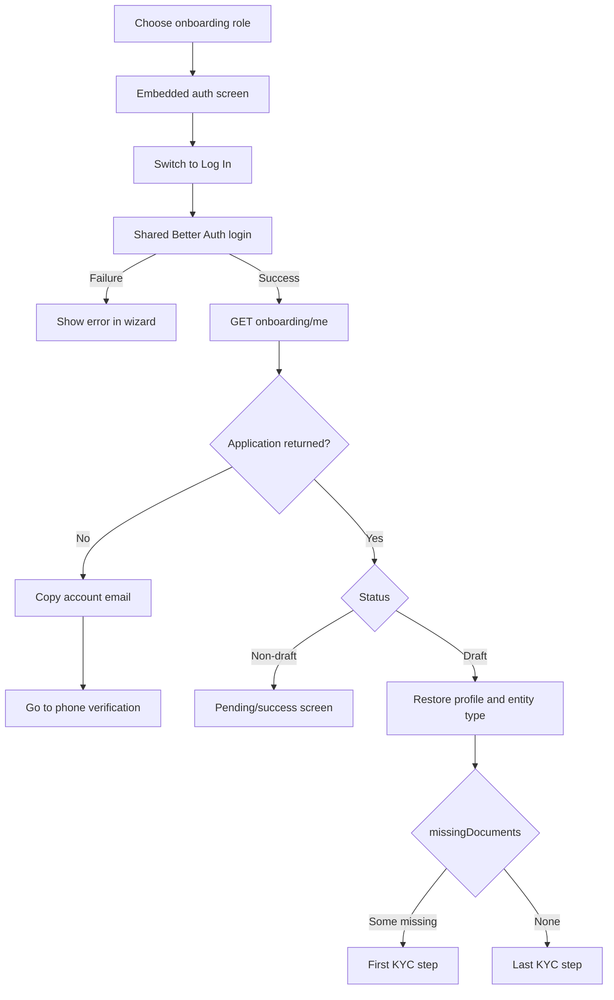
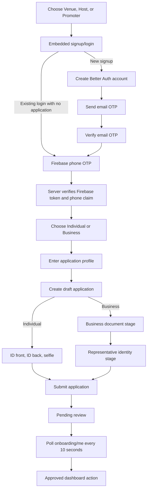

# Login, Signup, and Onboarding Flow

## Scope and verification basis

This document describes the current working-tree implementation across:

- Frontend: `C1RCLE-FRONTEND/apps/partner-dashboard`
- Shared frontend packages: `C1RCLE-FRONTEND/packages/auth`, `api-client`, and `contracts`
- Backend: `C1RCLE-BACKEND/apps/api-gateway` and `C1RCLE-BACKEND/packages/core`

It distinguishes the two login entry points:

1. Direct login through `/login` for an existing user.
2. Login initiated inside `/onboard` while applying or resuming onboarding.

The two entry points share the same account authentication request but use different post-login orchestration.

---

## 1. Architecture

The implementation uses three identity mechanisms:

1. Better Auth for account creation, email/password login, sessions, logout, and bearer access tokens.
2. A custom email OTP service for the onboarding email-confirmation screen.
3. Firebase/GCP Identity Platform for phone OTP, followed by server-side Firebase ID-token validation.

```mermaid
flowchart LR
    UI[Next.js UI]

    subgraph FE[Partner Dashboard]
        AuthClient[@c1rcle/auth]
        BFF[/api/auth BFF]
        ApiClient[Authenticated API client]
        FirebaseClient[Firebase Phone SDK]
    end

    subgraph BE[API Gateway]
        AuthRoutes[/api/v2/auth]
        OnboardingRoutes[/api/v2/onboarding]
        OrgRoutes[/api/v2/organizations]
        BetterAuth[Better Auth]
        EmailOtp[Email OTP service]
        OnboardingService[Onboarding service]
    end

    subgraph Stores[Persistence and providers]
        AuthStore[Firestore auth collections]
        OtpStore[v2_email_otps]
        AppStore[v2_onboarding_requests]
        AttemptStore[v2_verification_attempts]
        OrgStore[v2_organizations]
        Storage[Firebase/GCS bucket]
        Resend[Resend Email API]
        Identity[GCP Identity Platform]
    end

    UI --> AuthClient --> BFF --> AuthRoutes --> BetterAuth --> AuthStore
    UI --> ApiClient --> OnboardingRoutes --> OnboardingService
    OnboardingService --> AppStore
    OnboardingService --> AttemptStore
    OnboardingService --> Storage
    UI --> FirebaseClient --> Identity
    UI --> BFF --> EmailOtp --> OtpStore
    EmailOtp --> Resend
    UI --> ApiClient --> OrgRoutes --> OrgStore
```

### Principal frontend files

| Responsibility | Path |
|---|---|
| Direct login UI and post-login routing | `src/app/login/PageClient.tsx` |
| Standalone signup | `src/app/signup/page.tsx` |
| Onboarding wizard and embedded login/signup | `src/app/onboard/PageClient.tsx` |
| Onboarding auth context | `src/components/providers/DashboardAuthProvider.tsx` |
| Session bootstrap, refresh, focus refresh, idle logout | `src/components/providers/session-provider.tsx` |
| Browser-side gateway API composition | `src/lib/api/client.ts` |
| Auth BFF routes | `src/app/api/auth/**/route.ts` |
| Auth BFF security/cookie helpers | `src/lib/bff/auth-proxy.ts` |
| Onboarding gateway repository | `src/lib/onboarding/onboarding-repository.ts` |
| Email OTP client | `src/lib/onboarding/otp.ts` |
| Firebase phone client | `src/lib/firebase/phone-auth.ts` |
| Direct signed-URL upload | `src/lib/onboarding/uploadToSignedUrl.ts` |
| Organization repository | `src/lib/org/org-repository.ts` |
| Active-organization cookie | `src/lib/org/active-org.ts` |
| Post-auth routing helpers | `src/lib/org/route-after-auth.ts` |
| Edge route bouncer | `src/proxy.ts` |
| Shared auth implementation | `../../packages/auth/src/auth-client.ts` |
| In-memory auth state | `../../packages/auth/src/session-store.ts` |
| Auth wire contracts | `../../packages/contracts/src/contracts/auth.ts` |
| Onboarding wire contracts | `../../packages/contracts/src/contracts/onboarding.ts` |

### Principal backend files

All backend paths below are relative to `C1RCLE-BACKEND`.

| Responsibility | Path |
|---|---|
| Better Auth HTTP bridge | `apps/api-gateway/src/routes/v2/auth/index.ts` |
| Better Auth configuration and request actor resolution | `apps/api-gateway/src/plugins/auth.ts` |
| Email OTP HTTP routes | `apps/api-gateway/src/routes/v2/auth/otp-routes.ts` |
| Email delivery adapter | `apps/api-gateway/src/lib/notifications/resend-email-sender.ts` |
| Onboarding HTTP routes | `apps/api-gateway/src/routes/v2/onboarding.ts` |
| Phone-token verifier | `apps/api-gateway/src/lib/verification/firebase-phone-verifier.ts` |
| Rate-limit classes | `apps/api-gateway/src/plugins/rate-limit.ts` |
| Email OTP application service | `packages/core/src/application/auth/email-otp-service.ts` |
| Email OTP domain rules | `packages/core/src/domain/models/email-otp.ts` |
| Email OTP Firestore repository | `packages/core/src/infrastructure/firestore/firestore-email-otp-repository.ts` |
| Onboarding application service | `packages/core/src/application/onboarding/onboarding-service.ts` |
| Onboarding state/domain rules | `packages/core/src/domain/models/onboarding.ts` |
| Onboarding Firestore repository | `packages/core/src/infrastructure/firestore/firestore-onboarding-repository.ts` |
| Signed URL implementation | `packages/core/src/infrastructure/firestore/firebase-object-storage.ts` |
| Organization Firestore repository | `packages/core/src/infrastructure/firestore/firestore-organization-repository.ts` |
| Admin approval route | `apps/api-gateway/src/routes/v2/admin/onboarding-review.ts` |

---

## 2. Shared account authentication

### 2.1 Signup request

```json
{
  "email": "person@example.com",
  "password": "minimum-8-characters",
  "displayName": "Display Name"
}
```

Contract validation:

- `email`: valid email.
- `password`: 8 to 128 characters.
- `displayName`: 1 to 200 characters.
- Strict object; unknown keys are rejected.

The client never sends a platform role. The gateway calls Better Auth with:

```json
{
  "email": "person@example.com",
  "password": "minimum-8-characters",
  "name": "Display Name",
  "role": "partner"
}
```

The role is therefore assigned server-side.

### 2.2 Login request

```json
{
  "email": "person@example.com",
  "password": "password"
}
```

Contract validation:

- `email`: valid email.
- `password`: 1 to 128 characters.
- Strict object.

### 2.3 Login/signup/refresh response

```json
{
  "user": {
    "id": "user-id",
    "email": "person@example.com",
    "displayName": "Display Name",
    "role": "partner",
    "avatarUrl": null
  },
  "accessToken": "better-auth-session-token",
  "expiresAt": 1900000000000
}
```

The access token is Better Auth's session token, obtained from the `set-auth-token` response header or the resolved session. The backend does not mint a separate application JWT.

### 2.4 Session response

```json
{
  "user": {
    "id": "user-id",
    "email": "person@example.com",
    "displayName": "Display Name",
    "role": "partner",
    "avatarUrl": null
  },
  "expiresAt": 1900000000000
}
```

The session endpoint does not return an access token.

### 2.5 Browser storage and cookies

The shared session store keeps the following only in JavaScript memory:

- User.
- Access token.
- Expiry timestamp.
- Status: `unknown`, `authenticated`, or `anonymous`.
- A `hydrated` flag showing that initial session refresh has settled.

No access token is written by this auth layer to `localStorage` or `sessionStorage`.

Persistent session state uses the HTTP-only cookie:

```text
better-auth.session_token
```

The frontend auth BFF also creates the readable CSRF cookie:

```text
c1rcle.csrf
```

### 2.6 Auth BFF behavior

Login, signup, refresh, logout, and browser session checks go through same-origin Next.js routes.

On successful login or signup, the BFF:

1. Forwards the JSON request to the gateway.
2. Reads all gateway `Set-Cookie` values.
3. Removes the backend domain by reissuing them as host-only frontend cookies.
4. Forces `HttpOnly`, `SameSite=Lax`, frontend path, and production-only `Secure`.
5. Mints `c1rcle.csrf`, with `SameSite=Strict` and production-only `Secure`.
6. Returns the validated auth response to the shared auth client.

BFF defenses:

- A present `Origin` must equal the frontend origin.
- `Sec-Fetch-Site: cross-site` is rejected.
- `__proto__`, `constructor`, and `prototype` properties are recursively removed.
- Refresh and logout require the CSRF cookie and `x-csrf-token` header to match.
- Invalid JSON returns HTTP 400.
- A malformed/non-JSON gateway error becomes a generic authentication-service error.

Login/signup require the same-origin check but not a pre-existing CSRF token.

### 2.7 Better Auth storage

The Firestore adapter uses:

- `v2_auth_users`
- `v2_auth_sessions`
- `v2_auth_accounts`
- `v2_auth_verification_tokens`

Email/password authentication and the Better Auth bearer plugin are enabled.

The source records these Better Auth session defaults:

- HTTP-only, same-site-lax cookie.
- Seven-day session lifetime.
- One-day session update age.
- Secure cookies only in production.
- Trusted browser origins supplied by gateway configuration.

When `STORAGE_DRIVER=memory`, the backend does not build Better Auth. Auth endpoints return HTTP 503.

### 2.8 Session bootstrap and refresh

The root layout calls the gateway's `GET /api/v2/auth/session` server-to-server using the incoming cookie header. Any failure returns `null`.

When a session exists:

1. `SessionProvider` stores the server-provided user with a null token.
2. It calls `/api/auth/refresh` to obtain an in-memory token.
3. Refresh includes the HTTP-only session cookie and double-submit CSRF header.
4. The store becomes hydrated.

Additional behavior:

- Concurrent refreshes share one promise.
- Gateway requests use `Authorization: Bearer <token>`.
- A 401 triggers one refresh and one replay.
- Terminal unauthorized handling clears the session and sends the browser to `/login`.
- Default HTTP timeout is 15 seconds.
- Retryable network, timeout, rate-limit, and most 5xx failures are retried up to two times.
- `Retry-After` is honored up to 30 seconds.
- Returning to a visible tab within five minutes of expiry triggers refresh.
- Thirty minutes without pointer, key, or visibility activity triggers logout and `/login`.
- Logout always clears client state, even if gateway revocation fails.

---

## 3. Login entry point 1: direct existing-user flow

### 3.1 Entry sources

Direct login is reached from:

- Landing page `/login` CTA.
- Signup page's Sign In link.
- Onboarding's Back/Return to Login actions.
- API-client terminal unauthorized handling.
- Protected-route redirect to `/login?next=<pathname>`.

The edge bouncer protects `/venue`, `/host`, `/promoter`, `/partner`, and `/partner-network` by checking only whether `better-auth.session_token` is present. It cannot validate the cookie; gateway requests remain the security boundary.

`/onboard` is deliberately not gated.

### 3.2 Workspace-selection stage

The user first selects:

- Venue.
- Host.
- Promoter.

The selected value is saved in `userType` and placed in the URL as `type`.

`club` is normalized to `venue`. Unknown values normalize to `null`.

The selected workspace is not sent to the login endpoint. It is used only after authentication for organization compatibility and routing.

If any `type` query string is present, the component initially opens the credential screen. An invalid value can therefore open credentials while leaving `userType` null; submission then returns without displaying an error.

### 3.3 Credential stage

Inputs:

- Required HTML email input.
- Required password input with show/hide control.

Submission:

```http
POST /api/auth/login
Content-Type: application/json

{
  "email": "person@example.com",
  "password": "password"
}
```

The BFF forwards it to:

```http
POST /api/v2/auth/login
```

The gateway:

1. Applies `SENSITIVE_COMMAND`, currently 10 requests per minute for the compound rate-limit key.
2. Validates the strict login contract.
3. Calls `auth.api.signInEmail()`.
4. Converts every client-side login failure into the same `Authentication failed` response.
5. Resolves the newly established session.
6. Returns the user, session token, expiry, and session cookie.

The frontend shared auth client converts HTTP 400 or 401 into `Error("Authentication failed")`.

### 3.4 Post-login routing

```mermaid
flowchart TD
    A[Open /login] --> B{type present?}
    B -- No --> C[Select workspace]
    B -- Yes --> D[Credential screen]
    C --> D
    D --> E[Shared Better Auth login]
    E -->|Failure| F[Show generic invalid-credentials message]
    E -->|Success| G{next or callbackUrl?}
    G -- Yes --> H[Push supplied target]
    G -- No --> I[GET organizations]
    I --> J{Organization count}
    J -- Zero --> K[/onboard with selected type]
    J -- One or more --> L[Resolve access for every organization]
    L --> M{Matches selected partner type}
    M -- Zero --> N[Logout and show mismatch]
    M -- One --> O[Set active-org cookie]
    O --> P[Refresh token]
    P --> Q[/partner/type/overview]
    M -- Multiple --> R[Organization picker]
```

#### Redirect target present

`next` takes priority over `callbackUrl`.

When present, `router.push(target)` runs immediately after authentication and bypasses:

- Organization enumeration.
- Partner-type validation.
- Active-organization selection.

An already-authenticated user opening `/login` with one of these parameters is also redirected. The component contains no target allow-list or normalization.

#### No organizations

The route becomes:

```text
/onboard?type=<selected-workspace>
```

The new Better Auth session is retained. Onboarding initialization then checks for an existing open application.

#### Organization validation

For each organization, the browser requests:

```http
GET /api/v2/organizations/{organizationId}/access
Authorization: Bearer <accessToken>
x-organization-id: <organizationId>
```

Response shape:

```json
{
  "organizationId": "org-id",
  "userId": "user-id",
  "partnerType": "venue",
  "role": "owner",
  "permissions": [],
  "tabVisibility": null
}
```

The selected workspace is compared against `partnerType`, not `OrganizationDto.role`. The latter is an organization staff role such as owner, admin, manager, or member.

An access request that fails is treated as a non-matching organization.

#### Zero matching organizations

The flow:

1. Logs out.
2. Clears client session state.
3. Shows a workspace-specific mismatch message.
4. Offers a signup link containing the current email and selected type.

The standalone signup page does not currently read those query parameters.

#### Exactly one matching organization

The frontend:

1. Writes `c1rcle.active-org` for one year.
2. Calls refresh so token context can rotate.
3. Swallows refresh failure.
4. Goes to `/partner/{type}/overview`.

The active-org cookie is a readable organization-ID hint, not a credential.

#### Multiple matching organizations

The route becomes:

```text
/partner/select-organization?type=<selected-workspace>
```

The picker reloads all organizations and does not filter by the `type` query. When a user selects an organization, it asks the real `/access` endpoint for the correct studio route.

### 3.5 Direct-login errors

- API `fieldErrors` are reduced to their first message and rendered below email/password.
- `Authentication failed` becomes a friendly invalid-email-or-password message.
- Other API messages are shown.
- Unknown error values produce a generic unexpected-error message.
- Organization type mismatch logs the user out before showing the error.
- Organization/access failures can consequently appear as a workspace mismatch.

The Forgot Password control navigates to `/forgot-password`, optionally with `email`. There is no tracked partner-dashboard `/forgot-password` route, so this currently reaches not-found handling.

---

## 4. Login entry point 2: login inside onboarding

### 4.1 How it is selected

Onboarding begins with Role and then displays an embedded Signup stage. That screen has an in-place Sign Up / Log In toggle.

It can also switch automatically to existing-user mode when embedded signup throws an API error with status 409.

No navigation away from `/onboard` occurs, so local onboarding state is preserved.

### 4.2 Shared authentication logic

The embedded handler calls:

```ts
authSignIn(otpEmail, loginPassword)
```

`DashboardAuthProvider.signIn()` delegates to the same `@c1rcle/auth.login()` used by direct login. Therefore these are shared:

- Login payload and validation.
- Same-origin BFF.
- Better Auth call.
- Gateway rate limiting.
- Generic 400/401 normalization.
- Session cookie and CSRF cookie behavior.
- In-memory access-token storage.

### 4.3 Post-login behavior

Unlike direct login, success calls:

```http
GET /api/v2/onboarding/me
Authorization: Bearer <accessToken>
```



#### Non-draft application

The component stores the application ID and goes to the Success screen.

- `approved` maps to `verified` presentation.
- Every other non-draft status maps to `pending`.

In practice, backend `/onboarding/me` only returns draft, submitted, or changes-requested requests. Approved and rejected are excluded by its query.

#### Draft application

The frontend restores:

- Legal name.
- Contact person.
- Phone.
- City.
- Area.
- Website.
- Capacity.
- Instagram.
- Bio.
- Business type.
- Registration number.
- Entity type.

It does not restore:

- `requestedType` into the locally selected `partnerType`.
- Application plan into the local plan selector.
- Existing document metadata into KYC form state.
- A persisted wizard step, because the backend stores none.

Resume position is inferred only from `missingDocuments`:

- At least one missing label: first KYC step after Details.
- No missing labels: final KYC step.

#### No application

The account email is copied into local state and the wizard moves to phone verification.

It skips email OTP because the existing user just authenticated with the account email.

It does not check:

- Whether the account already has an organization.
- Whether the selected onboarding role matches existing organization access.
- Whether the user should instead be routed to a dashboard.

### 4.4 Direct-versus-onboarding login comparison

| Concern | Direct `/login` | Login within `/onboard` |
|---|---|---|
| Shared credential API | Yes | Yes |
| Workspace selected first | Yes | Yes |
| Honors `next`/`callbackUrl` | Yes | No |
| Lists organizations after login | Yes | No |
| Validates chosen type against `/access` | Yes | No |
| Logs out on type mismatch | Yes | No |
| Queries onboarding application immediately | No, only after navigation to `/onboard` | Yes |
| Resumes a draft | Through onboarding initialization | Immediately |
| No application result | Routes into onboarding | Starts at phone verification |
| Existing organization | Routes to matching dashboard | Not checked |
| Error wording | Friendly invalid-credentials text | Shared `Authentication failed` text |
| Preserves onboarding local state | Not applicable | Yes |

The two routes share low-level authentication, but not their post-auth controller.

---

## 5. Signup flows

There are two independent signup surfaces.

### 5.1 Standalone `/signup`

Inputs:

- Full/display name.
- Email.
- Password.
- Password confirmation.

Validation:

- All are browser-required.
- Email uses HTML email validation.
- Password and confirmation use `minLength=8`.
- Handler explicitly requires at least eight password characters.
- Handler explicitly requires password equality.
- Shared schema adds maximum password length 128 and display-name length 200.

Success:

```ts
await signup({ displayName, email, password });
router.push('/onboard');
```

This path does not perform email OTP verification.

When onboarding loads with this new authenticated user and no application, it goes to phone verification. It therefore skips the onboarding Role and Email Verification screens during initialization. Because standalone signup neither reads nor forwards a `type` parameter, partner type normally remains the onboarding default, `venue`.

Failures:

- API field errors are shown beside display name, email, or password.
- API message is displayed directly.
- Signup failures are not normalized like login failures.

### 5.2 Embedded signup in `/onboard`

Inputs:

- Full name.
- Email.
- Password.

Explicit validation:

- Trimmed name required.
- Email must satisfy `/^[^\s@]+@[^\s@]+\.[^\s@]+$/`.
- Password must contain at least eight characters.
- Shared strict contract applies additional maximums.

The handler executes sequentially:

```ts
await authSignUp(email, password, trimmedName);
await sendOtp(email);
```

Therefore the Better Auth account and session exist before the email OTP is sent.

If both calls succeed:

- Email is copied into form state.
- The OTP screen is marked as already sent.
- A local 60-second resend timer starts.
- Step becomes `email_verify`.

If signup succeeds and OTP sending fails:

- The account remains created.
- The session remains active.
- The wizard remains on Signup and displays the send error.
- Retrying tries to create the same account again.
- Reloading onboarding sees the authenticated/no-application condition and advances to phone verification, bypassing email OTP.

Only an `ApiClientError` with status 409 automatically switches the UI to existing-user login. The current gateway often maps Better Auth client errors to 400 unless a thrown error preserves another status, so this automatic transition is conditional. Manual Log In remains available.

---

## 6. Complete onboarding flow

### 6.1 Step sequences

Individual:

```text
role
→ signup
→ email_verify
→ phone_verify
→ entity_type
→ details
→ kyc_identity
→ success
```

Business:

```text
role
→ signup
→ email_verify
→ phone_verify
→ entity_type
→ details
→ kyc_business
→ kyc_signatory
→ success
```



### 6.2 Role

Choices:

- `venue`
- `host`
- `promoter`

The selected value later becomes `requestedType`. It is an application request, not a permission grant. Actual organization capability is created only on approval.

`?type=` can preselect it.

### 6.3 Email OTP

Send request:

```http
POST /api/auth/otp/send

{
  "email": "person@example.com"
}
```

Gateway request:

```http
POST /api/v2/auth/otp/send
```

Response:

```json
{
  "message": "If valid, a code has been sent."
}
```

Although the UI sends this after signup, the BFF does not forward the session cookie and the gateway route does not require a user. It is technically a pre-session operation keyed only by normalized email.

Backend processing:

1. Trim and lowercase recipient.
2. Load the existing OTP record.
3. Enforce 60-second resend cooldown.
4. Generate a CSPRNG six-digit numeric code.
5. HMAC-SHA256 hash it using a server secret.
6. Save one document per email in `v2_email_otps`.
7. Send through Resend.

Stored shape:

```json
{
  "recipient": "person@example.com",
  "codeHash": "hmac-sha256-hex",
  "expiresAt": "ISO timestamp",
  "lastSentAt": "ISO timestamp",
  "attempts": 0
}
```

Rules:

- Six digits.
- Ten-minute expiry.
- 60-second resend cooldown.
- Five failed-code attempts before lockout.
- Code hashes use constant-time comparison.
- Successful verification deletes the record, preventing replay.
- Resend replaces the previous record.
- HTTP send rate: 5/minute.
- HTTP verify rate: 10/minute.

Production without a Resend API key fails the send. In non-production without a key, the backend logs the development OTP.

Cooldown is hidden behind the same generic acknowledgement to reduce enumeration.

Verify request:

```http
POST /api/auth/otp/verify

{
  "email": "person@example.com",
  "code": "123456"
}
```

Success:

```json
{
  "message": "Verified."
}
```

Wrong, expired, locked, and absent OTP states are flattened to HTTP 400 with `Invalid or expired code.`

The successful operation only deletes the custom OTP record. It does not update Better Auth's user, persist an `emailVerified` flag, or attach verification state to the onboarding application.

After account creation, “Use a different email” changes the OTP recipient without changing the Better Auth account email.

### 6.4 Phone OTP

Frontend validation removes spaces and allows:

- A bare ten-digit Indian number, converted to `+91...`.
- `+91` followed by exactly ten digits.
- Another country code with at least eight digits total.

It rejects:

- Empty values.
- Letters or unsupported punctuation.
- Non-ten-digit bare numbers.
- Invalid `+91` length.
- Very short international values.

Firebase send flow:

1. Require public Firebase API key, auth domain, and project ID.
2. Clear a previous reCAPTCHA verifier.
3. Construct a fresh invisible verifier in the mounted container.
4. Call `signInWithPhoneNumber()`.

Production uses real reCAPTCHA and SMS. Development and preview enable Firebase test bypass, optionally prefilling the configured test phone. The exact Firebase Console test code is still required.

Confirmation:

1. `confirmation.confirm(code)`.
2. Obtain Firebase ID token.
3. Clear reCAPTCHA.
4. Sign out of Firebase.
5. Return token to the onboarding handler.

The active wizard then directly calls:

```http
POST /api/v2/onboarding/verify-document
Authorization: Bearer <accessToken>

{
  "documentType": "phone",
  "documentNumber": "+919876543210",
  "proofToken": "<firebase-id-token>"
}
```

The backend:

1. Requires an authenticated user.
2. Checks the shared verification attempt budget.
3. Verifies the token with Firebase Admin.
4. Reads `phone_number`.
5. Normalizes the token phone and supplied phone.
6. Rejects missing proof, invalid/expired token, absent claim, or mismatch.
7. Appends a verification attempt.

Success example:

```json
{
  "passed": true,
  "provider": "firebase-phone",
  "reason": "phone_verified",
  "referenceId": "firebase-uid"
}
```

All document and phone checks share five attempts per user per rolling 24 hours.

The `/api/auth/phone-verification` BFF exists but the active wizard does not call it. It uses the direct bearer-token route above.

After verification, the Details phone remains editable. The eventual application stores the edited form value. Verification attempt records do not store the verified number, so the verified phone and saved profile phone can differ.

### 6.5 Entity type

Choices:

- `individual`
- `business`

This changes the KYC sequence and is stored in `profile.entityType`. Backend `missingDocuments()` uses it to choose required labels.

### 6.6 Details and application creation

Request:

```json
{
  "requestedType": "venue",
  "plan": "silver",
  "profile": {
    "legalName": "Legal name",
    "contactPerson": "Primary contact",
    "phone": "+919876543210",
    "city": "Mumbai",
    "area": "Bandra",
    "website": "https://example.com",
    "capacity": 500,
    "instagram": "@example",
    "bio": "Profile",
    "businessType": "pvt_ltd",
    "registrationNumber": "registration-number",
    "entityType": "individual"
  }
}
```

Validation:

- `requestedType`: venue, host, or promoter.
- `plan`: basic, silver, or diamond.
- `legalName`: 1–200.
- `contactPerson`: 1–200.
- `phone`: 6–20.
- `city`: 1–120.
- `area`: optional, maximum 120.
- `website`: optional, maximum 300; contract does not require URL syntax.
- `capacity`: optional nullable nonnegative integer.
- `instagram`: optional, maximum 120.
- `bio`: optional, maximum 2000.
- `businessType`: optional, maximum 120.
- `registrationNumber`: optional, maximum 120.
- `entityType`: optional, maximum 120.
- Strict object.

UI-only values not sent to this API:

- Host category `role`.
- `association`.
- `associatedHostId`.
- `upcomingEventsText`.
- `pastEventsText`.
- Email/password as profile fields.

Role-specific UI:

- Venue: capacity and plan.
- Host: host category, but it is not persisted.
- Promoter: required Instagram and bio; upcoming/past event text remains local.
- Business: legal name, business type, optional registration/CIN.

The Venue plan selector exposes `gold`, but the contract accepts only basic, silver, and diamond. Gold therefore fails client-side schema parsing before an HTTP request.

Application creation:

```http
POST /api/v2/onboarding/applications
Authorization: Bearer <accessToken>
Idempotency-Key: <random UUID>
```

Backend processing:

1. Require authenticated user.
2. Validate body and idempotency key.
3. Search for an open application belonging to the user.
4. Create a version-1 draft with no documents.
5. Sanitize the profile against an explicit allow-list.
6. Save through compare-and-set.
7. Return HTTP 201 with the DTO.

The open-application check covers draft, submitted, and changes-requested status. Its domain error maps to HTTP 400, while the frontend's special “already in progress” branch checks for 409.

### 6.7 Application DTO

```json
{
  "id": "request-id",
  "userId": "user-id",
  "status": "draft",
  "requestedType": "venue",
  "plan": "silver",
  "profile": {},
  "documents": [],
  "missingDocuments": ["id_front", "id_back", "selfie"],
  "submittedAt": null,
  "reviewedBy": null,
  "reviewedAt": null,
  "reviewNote": null,
  "provisionedOrganizationId": null,
  "version": 1,
  "createdAt": "ISO timestamp",
  "updatedAt": "ISO timestamp"
}
```

Statuses:

```text
draft
submitted
changes_requested
approved
rejected
```

Transitions:

```text
draft → submitted
submitted → approved
submitted → rejected
submitted → changes_requested
changes_requested → submitted
```

Approved and rejected are terminal.

### 6.8 Save progress and resume

```http
PATCH /api/v2/onboarding/applications/{requestId}
Authorization: Bearer <accessToken>
```

The body is a strict partial profile.

Backend rules:

- Only draft or changes-requested requests are editable.
- Ownership must match the session user.
- Another user's ID is treated as not found.
- Save increments optimistic version.

The UI function is named autosave, but it does not run on every keystroke. It is invoked while advancing between intermediate KYC stages. Initial Details submission already saves the whole profile.

If the user returns to Details after an application exists, submitting the form calls Start again rather than PATCH and produces an already-open-application error.

Resume uses `GET /api/v2/onboarding/me`. No wizard-step field exists. The frontend derives its step from profile/entity type and `missingDocuments`.

### 6.9 Individual identity KYC

Inputs:

- ID type: Aadhaar, passport, driving licence, or voter ID.
- ID number.
- Document front.
- Document back.
- Selfie.

All ID types require three uploads in the frontend and backend.

For Aadhaar:

- UI enables verification at 12 characters.
- Backend format check requires 12 digits beginning with 2–9.
- This is only a regex-based format check, not a government identity lookup.
- Other ID types do not call document verification.

The UI currently labels a passing Aadhaar format result as “Verified” and “Aadhaar structurally verified.”

### 6.10 Document upload

Frontend checks:

- Application ID must exist.
- File size at most 5 MB.
- MIME type must be JPEG, PNG, or WebP.

Step 1, signed URL:

```http
POST /api/v2/onboarding/applications/{requestId}/documents/upload-url

{
  "label": "id_front",
  "contentType": "image/jpeg"
}
```

Response:

```json
{
  "uploadUrl": "https://storage-signed-url",
  "method": "PUT",
  "headers": {
    "content-type": "image/jpeg",
    "x-goog-content-length-range": "0,5242880"
  },
  "storagePath": "kyc/user-id/request-id/id_front",
  "expiresAt": 1900000000000
}
```

Backend grant properties:

- Ten-minute expiry.
- Bound content type.
- Maximum five-megabyte byte range.
- Deterministic key: `kyc/{userId}/{requestId}/{label}`.

Step 2, direct storage upload:

```http
PUT <uploadUrl>
<returned headers>

<raw file bytes>
```

The gateway does not receive the bytes.

Step 3, record metadata:

```http
POST /api/v2/onboarding/applications/{requestId}/documents
Idempotency-Key: <random UUID>

{
  "label": "id_front",
  "storagePath": "kyc/user-id/request-id/id_front"
}
```

Re-uploading a label replaces its metadata and overwrites the deterministic object.

The UI remove button clears local state only. It does not delete the object or remove backend metadata.

Individual required labels:

```text
id_front
id_back
selfie
```

### 6.11 Business KYC blocking inconsistencies

Backend-required business labels:

```text
registration_certificate
sig_id_front
sig_id_back
sig_selfie
```

The current implementation cannot complete this path:

1. `KycBusinessForm` sends `requestId={null}` to the registration-certificate upload zone.
2. The upload handler rejects a missing request ID before its intended local-only fallback.
3. Registration upload therefore reports that the application has not been created.
4. `regDoc` stays empty, leaving the Business Continue button disabled.
5. If signatory is reached, its three uploads use `id_front`, `id_back`, and `selfie`, not `sig_*`.
6. Backend signed-URL service currently permits only the individual `REQUIRED_DOCUMENT_LABELS`, even though the shared request schema includes business labels.
7. Submission computes the four business labels as missing.

Business onboarding is therefore not end-to-end completable in the current code.

### 6.12 Submission

```http
POST /api/v2/onboarding/applications/{requestId}/submit
Authorization: Bearer <accessToken>
Idempotency-Key: <random UUID>
```

The frontend sends JSON `null` as the body.

Backend processing:

1. Confirm ownership.
2. Compute missing labels from stored documents.
3. Reject if any are missing.
4. Transition to submitted.
5. Set `submittedAt`.
6. Increment version.
7. Save and return the DTO.

For individual onboarding, Identity is the last pre-success step, so Continue immediately submits.

The parent sets KYC submitting state but does not read it. KYC forms receive `submitting={false}`, so final submission does not disable the button or render the parent loading state.

Missing-document errors are HTTP 400. If there are no API field errors, the UI replaces the exact backend missing-label message with a generic upload-all-documents message.

### 6.13 Pending, review, and approval

After submission:

- Step becomes Success.
- Approval presentation is pending.
- `/onboarding/me` is checked immediately and every ten seconds.
- Poll failures are ignored.
- Return to Login signs out and navigates to `/login`.

Admin approval:

1. Requires `ONBOARDING_APPROVE` authority.
2. Requires submitted status.
3. Creates an organization before changing the request.
4. Uses application legal name as organization name.
5. Creates a unique slug from the name plus request-ID suffix.
6. Makes the applicant the owner.
7. Grants only the requested capability.
8. Sets timezone `Asia/Kolkata`.
9. Applies plan fee:

| Plan | Platform fee |
|---|---:|
| Basic | 15% |
| Silver | 12% |
| Diamond | 10% |

10. Saves the organization to `v2_organizations`.
11. Updates the request with approved status, reviewer, timestamp, note, and organization ID.
12. Writes an append-only admin audit record.

Organizations store a denormalized `memberIds` array used to list organizations for a user.

#### Approval polling mismatch

The frontend expects `/onboarding/me` to return approved status. The Firestore repository searches only open statuses:

```text
draft
submitted
changes_requested
```

After approval, `/onboarding/me` returns `{ "request": null }`. The poll ignores null and remains pending, so the approved Go to Dashboard presentation is not reached through this backend query.

After the user returns to direct login, the provisioned organization is visible through `GET /organizations`, allowing normal dashboard routing.

---

## 7. API matrix

### Auth and BFF

| Frontend route | Gateway route | Auth material | Request | Success |
|---|---|---|---|---|
| `POST /api/auth/signup` | `POST /api/v2/auth/signup` | None | `{email,password,displayName}` | 201 auth bridge and cookies |
| `POST /api/auth/login` | `POST /api/v2/auth/login` | None | `{email,password}` | 200 auth bridge and cookies |
| `POST /api/auth/refresh` | `POST /api/v2/auth/refresh` | Session cookie and CSRF | `null` | 200 auth bridge |
| `POST /api/auth/logout` | `POST /api/v2/auth/logout` | Session cookie and CSRF | `null` | 204 |
| `GET /api/auth/session` | `GET /api/v2/auth/session` | Session cookie | None | 200 session |
| `POST /api/auth/otp/send` | `POST /api/v2/auth/otp/send` | None | `{email}` | 200 generic ack |
| `POST /api/auth/otp/verify` | `POST /api/v2/auth/otp/verify` | None | `{email,code}` | 200 verified ack |
| `POST /api/auth/phone-verification` | `POST /api/v2/onboarding/verify-document` | Cookie and CSRF | `{phoneNumber,idToken}` | 200 result; currently unused by wizard |

### Onboarding and routing

| Method and path | Request | Result |
|---|---|---|
| `GET /api/v2/onboarding/me` | None | Open application or null |
| `POST /api/v2/onboarding/applications` | `{requestedType,plan,profile}` plus idempotency | Create draft |
| `PATCH /api/v2/onboarding/applications/:id` | Partial strict profile | Update profile |
| `POST .../:id/documents/upload-url` | `{label,contentType}` | Signed PUT grant |
| `PUT <signed URL>` | Raw file and returned headers | Store image |
| `POST .../:id/documents` | `{label,storagePath}` plus idempotency | Record/replace metadata |
| `POST /api/v2/onboarding/verify-document` | Document number/proof | Verification result and attempt log |
| `POST .../:id/submit` | Idempotency key | Submitted application |
| `GET /api/v2/organizations` | None | Paginated organizations |
| `GET /api/v2/organizations/:id/access` | `x-organization-id` | Partner type and permissions |

### Error envelope

```json
{
  "status": 400,
  "code": "validation",
  "message": "Human-readable message",
  "requestId": "correlation-id",
  "fieldErrors": {
    "email": ["Invalid email"]
  },
  "details": {}
}
```

The API client maps statuses to validation, unauthorized, forbidden, not-found, conflict, rate-limited, server, and unknown codes. It separately creates network, timeout, aborted, and parse errors.

Every expected successful JSON response is Zod-validated. A response-contract mismatch becomes a parse error stating that frontend and backend are out of sync.

---

## 8. Persistence summary

| Data | Store | Operation |
|---|---|---|
| Auth users | `v2_auth_users` | Account record managed by Better Auth |
| Password accounts | `v2_auth_accounts` | Credentials managed by Better Auth |
| Sessions | `v2_auth_sessions` | Create/read/revoke via Better Auth |
| Better Auth verification | `v2_auth_verification_tokens` | Adapter configured; separate from custom OTP |
| Email OTP | `v2_email_otps` | Save, failed-attempt update, delete on success |
| Applications | `v2_onboarding_requests` | Create, profile update, document metadata, status review |
| Verification attempts | `v2_verification_attempts` | Append and rolling-window count |
| Organizations | `v2_organizations` | Provision on approval, query by `memberIds` |
| Idempotency | `v2_idempotency_records` | Replay protection for commands |
| KYC image bytes | Firebase/GCS | Direct signed PUT |
| Admin audit | `v2_admin_audit_logs` | Append-only review audit |

Application and organization persistence uses compare-and-set versioning.

---

## 9. Verified edge cases and gaps

1. Business onboarding cannot finish because registration upload is blocked and required labels do not align.
2. Approved requests disappear from `/onboarding/me`, preventing approval polling from completing.
3. Rejected requests also disappear and can be treated as no application.
4. `changes_requested` is shown as pending instead of reopening correction steps.
5. Standalone signup skips email OTP on onboarding initialization.
6. Standalone signup usually defaults the application type to Venue.
7. Email OTP success is not persisted onto the Better Auth user or application.
8. An OTP for a different email can be verified after the account is created without changing account email.
9. OTP-send failure may leave an account/session already created.
10. The saved phone can be edited after a different phone was verified.
11. Direct-login `next`/`callbackUrl` bypasses organization/type validation and has no local allow-list.
12. An invalid direct-login `type` can open credentials but make submission silently return.
13. An access-service failure may be treated as workspace mismatch and log the user out.
14. The multi-org picker ignores the login `type` query and renders all organizations.
15. `getOrganizations()` consumes only the returned paginated page when making login decisions.
16. Gold tier is offered by the Venue UI but rejected by the contract.
17. Removing a file in the UI does not remove its backend metadata or object.
18. Resumed KYC forms do not hydrate existing uploaded-document state.
19. Returning to Details after draft creation tries to start a second application rather than patch it.
20. Final KYC submission loading state is not wired into the form.
21. Aadhaar “Verified” means only format-valid, not government-verified.
22. Phone and Aadhaar checks share the same five-attempt daily budget.
23. Forgot Password navigates to a route that is not implemented in the tracked app.
24. An already-authenticated user opening `/login` without a redirect target remains on login.
25. Active organization is only an ID hint; backend session and membership checks still authorize requests.

---

## 10. End-to-end summaries

### 10.1 Existing approved user through direct login

1. Open `/login`.
2. Choose workspace type.
3. Enter email/password.
4. Shared client validates and calls same-origin BFF.
5. BFF calls gateway Better Auth route.
6. Better Auth validates credentials and resolves a session.
7. BFF re-scopes session cookie and creates CSRF cookie.
8. Access token is stored in memory.
9. Frontend lists organizations.
10. It asks `/access` for each organization.
11. Organizations are filtered by selected partner type.
12. Zero matches logs out; one match routes to the studio; multiple matches open the picker.

### 10.2 Existing user through onboarding login

1. Open `/onboard`.
2. Choose applicant role.
3. Switch embedded auth screen to Log In.
4. Use the same BFF and Better Auth login implementation.
5. Call `/onboarding/me`.
6. Draft: restore profile and resume KYC.
7. Submitted/changes-requested: show pending screen.
8. No returned application: skip email OTP and start phone verification.
9. Do not validate organizations or selected workspace.
10. Do not route directly to a dashboard.

### 10.3 New user through embedded onboarding signup

1. Choose applicant role.
2. Enter name, email, password.
3. Better Auth creates partner account and session.
4. Custom email OTP is generated, HMAC-hashed, stored, and delivered.
5. Verify six-digit email OTP.
6. Firebase sends and confirms phone OTP.
7. Gateway verifies Firebase token and phone claim.
8. Choose individual or business entity.
9. Enter profile details.
10. Create draft application.
11. Individual: upload three required documents.
12. Submit application.
13. Admin approval creates organization, owner membership, requested capability, plan fee, and audit.
14. Current approval polling remains pending because approved requests are excluded from `/onboarding/me`.
15. Direct login later sees the provisioned organization and routes to its dashboard.

### 10.4 New user through standalone signup

1. Open `/signup`.
2. Enter display name, email, password, and confirmation.
3. Create Better Auth account and session.
4. Navigate to `/onboard` without role/email query state.
5. Onboarding sees authenticated user with no application and goes directly to phone verification.
6. Email OTP and initial role selection are skipped.
7. Partner type normally remains Venue.
8. Continue through phone, entity, details, KYC, submission, and manual review.
