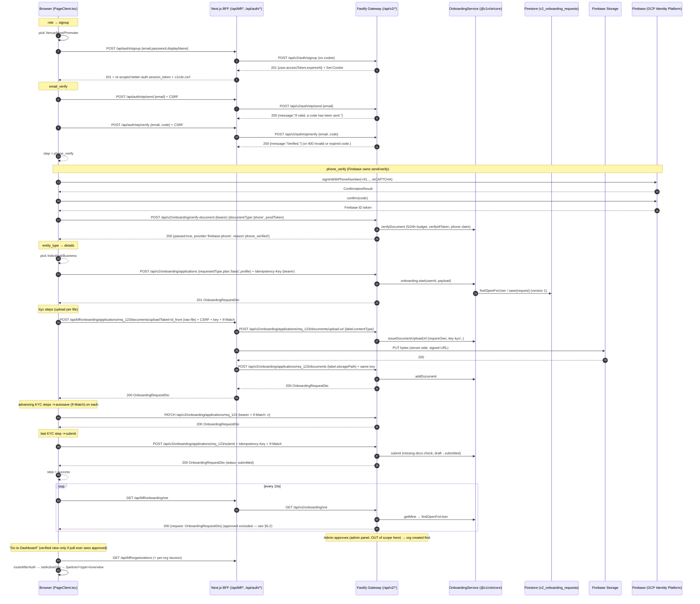

# Partner Dashboard — Onboarding Flow (Browser → BFF/Gateway → Backend → Database)

> **What this document is:** a line-by-line, end-to-end trace of the **Partner
> onboarding wizard** exactly as it is implemented in the **current working
> tree** (uncommitted changes included). It goes
> `Browser → BFF / Gateway → Backend → Database` for **every step**, shows the
> JSON at each stage, and notes where a payload changes. Nothing here is
> assumed — every endpoint, file path, and field was read from the two
> repositories that implement this flow:
>
> - Frontend monorepo: `D:\C1RCLE-FRONTEND` (`apps/partner-dashboard`,
>   `packages/{api-client,auth,contracts,config}`)
> - Backend monorepo: `D:\C1RCLE-BACKEND` (`apps/api-gateway`,
>   `packages/core`), deployed as **https://circle-v2-backend.onrender.com**
>
> The wizard uses a **split transport model**:
> - **Reads and file uploads** go same-origin through the Next.js **BFF**
>   (`/api/bff/onboarding/*`, `/api/bff/organizations/*`, `/api/auth/*`) and are
>   authenticated by the **session cookie** (no bearer header needed).
> - **State-changing application commands** (`start`, `autosave`, `submit`,
>   `verify-document`) call the gateway **directly from the browser** with the
>   in-memory **Bearer** token via the shared `@c1rcle/api-client`.
> - **Email OTP and phone token verification** are *not* sent over the wire for
>   everything: email OTP goes through `/api/auth/otp/*`; phone OTP is
>   Firebase/GCP-side; only the resulting Firebase ID token is confirmed
>   server-side through `POST /api/v2/onboarding/verify-document`.

---

## 1. Architecture diagram

```text
                         PARTNER-DASHBOARD  (Next.js 16, apps/partner-dashboard)
┌───────────────────────────────────────────────────────────────────────────────┐
│  Browser  ──────────  /onboard  (PageClient.tsx — 8 or 9 step wizard)         │
│    │                                                                          │
│    ├── same-origin BFF  (cookie auth, CSRF, no bearer):                       │
│    │     getMine()                       GET  /api/bff/onboarding/me          │
│    │     uploadDocument()                POST /api/bff/onboarding/            │
│    │                                        applications/:id/documents/upload │
│    │     getOrganizations()              GET  /api/bff/organizations          │
│    │     getPartnerAccess(orgId)         GET  /api/bff/organizations/:id/access
│    │     sendOtp/verifyOtp               POST /api/auth/otp/send|verify       │
│    │     signup/login/refresh/logout     POST /api/auth/*                     │
│    └── direct gateway  (Bearer token, @c1rcle/api-client, reauth-on-401):     │
│          start()                         POST /api/v2/onboarding/applications │
│          saveProgress()                  PATCH /api/v2/onboarding/            │
│                                               applications/:id                │
│          submit()                        POST /api/v2/onboarding/             │
│                                               applications/:id/submit         │
│          verifyDocument()                POST /api/v2/onboarding/verify-document
└────┼──────────────────────────────────────────────────────────────────────────┘
     ▼
┌───────────────────────────────────────────────────────────────────────────────┐
│  API GATEWAY  (Fastify, apps/api-gateway)  https://circle-v2-backend.onrender │
│  .com/api/v2/*                                                                │
│    • Better Auth session resolution (plugins/auth.ts)                          │
│    • zod validation (plugins/validate-v2.ts) → 422 fieldErrors                 │
│    • rate limits (AUTH_READ / STANDARD_COMMAND / SENSITIVE_COMMAND /           │
│      OTP_SEND / OTP_VERIFY)                                                    │
│    • idempotency wrapper (lib/v2-idempotency.ts)                               │
│    • v2 error envelope { status, code, message, requestId, fieldErrors }       │
└────┼──────────────────────────────────────────────────────────────────────────┘
     ▼
┌───────────────────────────────────────────────────────────────────────────────┐
│  BACKEND DOMAIN  (@c1rcle/core)  OnboardingService + EmailOtpService          │
│    (packages/core/src/application/{onboarding,auth})                          │
│    validation: status FSM, ownership, document set, profile sanitisation,     │
│    OTP cooldown/attempts, verification budget                                 │
└────┼──────────────────────────────────────────────────────────────────────────┘
     ▼
┌───────────────────────────────────────────────────────────────────────────────┐
│  DATABASE   Firestore (Firebase Admin SDK)                                    │
│    v2_onboarding_requests   (document per application)                        │
│    v2_email_otps            (one doc per normalized recipient)                │
│    v2_verification_attempts (verify-document attempt log)                     │
│    v2_organizations         (created on approval)                             │
│    v2_auth_*                (Better Auth sessions)                            │
│    v2_admin_audit_logs      (approval/review trail)                           │
│  OBJECT STORAGE  Firebase Storage  → kyc/<userId>/<requestId>/<label>         │
│    (PUT happens server-side inside the BFF—the browser never sees the URL)    │
└───────────────────────────────────────────────────────────────────────────────┘
```

The two monorepos involved split cleanly down the middle of the diagram:

| Layer | Where the code lives |
|-------|----------------------|
| Frontend wizard / BFF | `D:\C1RCLE-FRONTEND\apps\partner-dashboard` |
| API client + contracts | `D:\C1RCLE-FRONTEND\packages\{api-client,auth,contracts,config}` |
| API Gateway (routes) | `D:\C1RCLE-BACKEND\apps\api-gateway\src` |
| Backend service + domain | `D:\C1RCLE-BACKEND\packages\core\src` |
| Database / storage | Firestore + Firebase Storage (project from `FIRESTORE_PROJECT_ID`) |

---

## 2. The wizard steps (frontend)

The onboarding screen lives at route **`/onboard`**:

| File | Role |
|------|------|
| `apps/partner-dashboard/src/app/onboard/page.tsx` | Server component, renders `PageClient`, sets metadata |
| `apps/partner-dashboard/src/app/onboard/layout.tsx` | Wraps children in `DashboardAuthProvider` (no `SessionProvider`) |
| `apps/partner-dashboard/src/app/onboard/PageClient.tsx` | **The entire wizard** (2640 lines, `'use client'`) |

### Step sequence

```ts
type OnboardingStep =
  | 'signup' | 'email_verify' | 'phone_verify' | 'entity_type'
  | 'role' | 'details' | 'kyc_identity' | 'kyc_business'
  | 'kyc_signatory' | 'success';
```

`getStepSequence(entityType)` computes the tail dynamically:

| Entity type | Sequence |
|---|---|
| `individual` | `role → signup → email_verify → phone_verify → entity_type → details → kyc_identity → success` (**8 steps**) |
| `business` | `role → signup → email_verify → phone_verify → entity_type → details → kyc_business → kyc_signatory → success` (**9 steps**) |

Step labels: `signup` **Sign Up**, `email_verify` **Email**, `phone_verify` **Phone**,
`entity_type` **Entity**, `role` **Role**, `details` **Details**,
`kyc_identity` **Identity**, `kyc_business` **Business**, `kyc_signatory` **Signatory**,
`success` **Done**. The progress header hides on `success`; each completed bubble is
clickable to jump back. The header back button at step index 0 →
`router.replace('/login')`; otherwise it moves one step backward.

### 2.1 What each step does

| Step | UI | Network action (on advance) |
|------|----|------------------------------|
| `role` | 3 `RoleCard`s — Venue Partner, Event Host, Promoter | none; Continue → `signup` |
| `signup` | In-place **Sign Up / Log In toggle** (`emailExists`). Sign-up: Full Name, Email, Password (+ eye). Log-in: Email + Password | **Sign up**: `authSignUp(email, password, name)` then **`sendOtp(email)`** (sequential). **Log in**: `authSignIn(email, password)` then `getMine()` (see §2.4). |
| `email_verify` | Email field (disabled once sent), 6-digit `OtpInput`, Send Code, Verify Email, `ResendButton` (60 s cooldown), "Use a different email" | `sendOtp(email)` → `POST /api/auth/otp/send`; `verifyOtp(email, code)` → `POST /api/auth/otp/verify` → on success → `phone_verify` |
| `phone_verify` | Phone field (sanitised digits/`+`/spaces), invisible reCAPTCHA anchor `#phone-verify-recaptcha`, test-bypass banner in dev/preview, `OtpInput`, verify/resend, "Use a different number" | Firebase `sendPhoneOtp(toE164(...))` (no HTTP of its own); `confirmPhoneOtp(code)` → Firebase ID token → **`verifyDocument({documentType:'phone', documentNumber, proofToken})`** → direct gateway → `entity_type` |
| `entity_type` | Individual / Business card pick | none → `details` |
| `details` | "Signed In As" banner + entity/profile fields (see §2.2) | `start(...)` → `POST /api/v2/onboarding/applications` (plan hard-coded `'basic'`) → first KYC step |
| `kyc_identity` | `<KycIdentityForm>` — ID type/number, doc front/back/selfie, optional Aadhaar format-check | `uploadDocument()` per file; "Verify Aadhaar" → `verifyDocument({documentType:'aadhaar', ...})` (format check only) |
| `kyc_business` | `<KycBusinessForm>` — PAN, GST (opt), registered address, registration certificate | registration certificate is **local-only** (no real slot, never uploaded — see §2.3) |
| `kyc_signatory` | `<KycSignatoryForm>` — signatory name/designation/email/phone, ID type/number, doc front/back/selfie | `uploadDocument()` per file (labels `id_front`/`id_back`/`selfie`) |
| `success` | Approved view ("You're Approved" + **Go to Dashboard**) vs Pending view ("Application Submitted" + What Happens Next + Return to Login) | polls `getMine()` immediately then every **10 s** |

### 2.2 Details step fields

The Details form maps server vocabulary onto local state via `PROFILE_KEY_MAP`.

- **Common:** `legalName` (label differs: business → "Legal Business Name"; individual by partner type → "Venue Name" / "Brand / Collective Name" / "Your Full Name"), `contactPerson` ("Authorized Contact" for business / "Contact Person"), `phone`, `city` (select of `CITIES`: Pune, Mumbai, Goa, Bengaluru, Delhi, Hyderabad, Chennai, Kolkata, Jaipur, Ahmedabad), `area`, `website` (optional).
- **Business only:** `businessType` select (5 `BUSINESS_TYPES`), `registrationNumber` optional (CIN).
- **Venue only:** `capacity`.
- **Host only:** `hostCategory` select (`organizer`/`dj`/`collective`) — **UI-local only**, never sent.
- **Promoter only:** `instagram`, `bio`, `upcomingEventsText`, `pastEventsText` — the two event textareas are **UI-local only** (schema is `.strict()`).

### 2.3 KYC document slots

`KycFileZone` uploads a file **immediately on selection** (no per-step submit):

- Client checks: application exists, size ≤ **5 MB**, MIME ∈ `image/jpeg | image/png | image/webp`.
- With a real `docLabel` → `uploadDocument(requestId, docLabel, file, uuid)` → the BFF upload route (§3.3).
- **Without** a `docLabel` (e.g. business **registration certificate**, `reg_doc`) → **local-only fallback**: `URL.createObjectURL(file)`; never durably uploaded; a comment at `PageClient.tsx:1983` explains the document model only has the three labels.

Real labels used by the forms:

| Form | Uploaded labels |
|---|---|
| `KycIdentityForm` (individual) | `id_front`, `id_back`, `selfie` |
| `KycSignatoryForm` (business) | `id_front`, `id_back`, `selfie` (signatory's ID + selfie) |
| `KycBusinessForm` (business) | **none** — registration certificate is local placeholder |

`KycIdentityForm` includes an "ID Type" select and "Verify Aadhaar" handler that calls
`verifyDocument({documentType:'aadhaar', documentNumber})` (12 digits enabled) — this is a
**format check** only (`provider: 'format-check'`), displayed as "Aadhaar structurally verified."

### 2.4 Auth embedded login / signup

- **Sign-up** (`handleSignup`): `authSignUp(email, password, trimmedName)` → account+session exist → send email OTP → step `email_verify`. If OTP send fails the account/session already exists; retry tries to recreate.
- **Log-in** (`handleExistingUserLogin`): `authSignIn(email, password)` → `getMine()`:
  - non-draft → restore `submittedRequestId`, set approval status (`verified` only when `approved`), step `success`;
  - draft → restore profile fields + `entityType`, resume step = first KYC step when `missingDocuments.length > 0`, else last KYC step (submit); step that;
  - **no application** → prefill email, step `phone_verify` (skips email OTP — account already authenticated).
- An API error with status **409** from embedded signup switches the UI to existing-user login automatically; there's always a manual Log In toggle.

### 2.5 Initial state / resume

`checkInitialState` runs once after `authLoading` settles:

- No auth user → step `role`.
- Auth user → `getMine()`:
  - none → prefill email, step `phone_verify`;
  - draft → restore profile/`entityType` and resume via `missingDocuments` (same rule as §2.4);
  - submitted/changes_requested → step `success` (pending); approved → `success` (verified).

**There is no `sessionStorage` step persistence.** (Grep across `src` shows `sessionStorage`
only for the `c1rcle.session.bootstrap` guard key in `session-provider.tsx`.) Resume position and
fields are **re-derived server-side from `getMine()`** (`profile` + `missingDocuments`).

### 2.6 Create, autosave, submit

- **Create** (`handleCreateAccount`, `details` Continue): `startOnboarding({requestedType: partnerType, plan: 'basic', profile: {...}}, crypto.randomUUID())` → **direct gateway** `POST /api/v2/onboarding/applications` with header `Idempotency-Key`. A **409** shows "You already have an application in progress."; other errors map `fieldErrors` per-field.
- **Autosave** (`saveProgress`): `PATCH /api/v2/onboarding/applications/:id` (direct, bearer + `If-Match`) — **no 800 ms debounce any more**; it only runs while **advancing between intermediate KYC steps** and is best-effort (errors swallowed).
- **Submit** (`submitApplication`): `submitOnboardingApplication(requestId, crypto.randomUUID())` → direct gateway `POST /api/v2/onboarding/applications/:id/submit` (`Idempotency-Key` + `If-Match`). Triggered when leaving the **second-to-last sequence step** (`kyc_identity` for individual; `kyc_signatory` for business). 400 → "Please upload all required documents before submitting."
- **Optimistic locking** (`onboarding-repository.ts`): a module-level `versionByRequestId` map sends `If-Match: <version>`; on **409** it re-reads `getMine()`, re-records the version, and retries **once** with the same idempotency key.

### 2.7 Success / approval polling

On `success` with a `submittedRequestId`: `getMine()` immediately, then `setInterval(checkApproval, 10_000)`. `approved` → `approvalStatus 'verified'`, else `'pending'`. Interval cleared on unmount/step change. The Approved view's **Go to Dashboard** calls `routeAfterAuth(router)` (§6.1).

---

## 3. The BFF layer (Next.js route handlers)

### 3.1 Routing inventory (browser → BFF → gateway)

**Auth BFF** (`src/app/api/auth/*` — all re-scope session cookies on success; login/signup also mint the CSRF cookie):

| Browser endpoint | Method | Gateway forward | Guard | Notes |
|---|---|---|---|---|
| `/api/auth/signup` | POST | `POST /api/v2/auth/signup` | same-origin only | 201 + cookies + CSRF mint |
| `/api/auth/login` | POST | `POST /api/v2/auth/login` | same-origin only | 200 + cookies + CSRF mint; every gateway 4xx is `Authentication failed` |
| `/api/auth/refresh` | POST | `POST /api/v2/auth/refresh` | same-origin + CSRF | 200 + re-scoped cookie; 401 → unauthorized |
| `/api/auth/logout` | POST | `POST /api/v2/auth/logout` | same-origin + CSRF | best-effort (`.catch(() => null)`); always 204 + `clearCsrfCookie` |
| `/api/auth/session` | GET | `GET /api/v2/auth/session` | same-origin | 401 → synthesized `{code:'unauthorized'}` |
| `/api/auth/otp/send` | POST | `POST /api/v2/auth/otp/send` | same-origin + CSRF | body `{email}`; generic ack `{message}` |
| `/api/auth/otp/verify` | POST | `POST /api/v2/auth/otp/verify` | same-origin + CSRF | body `{email, code}`; real 400 `Invalid or expired code.` passed through |
| `/api/auth/phone-verification` | POST | `POST /api/v2/onboarding/verify-document` (body rewritten to `{documentType:'phone', documentNumber, proofToken}`) | same-origin + CSRF | cookie-auth twin of the direct-bearer route; **not on the wizard path** (§6.3) |

**Onboarding BFF** (`src/app/api/bff/onboarding/*`):

| Browser endpoint | Method | Gateway forward | Idempotency-Key | If-Match | Notes |
|---|---|---|---|---|---|
| `/api/bff/onboarding/me` | GET | `GET /api/v2/onboarding/me` | no | no | on success, if no `c1rcle.csrf` cookie present, mints one (returning applicants) |
| `/api/bff/onboarding/applications` | POST | `POST /api/v2/onboarding/applications` | optional (forwarded) | no | 201 + re-scoped cookies |
| `/api/bff/onboarding/applications/:id` | PATCH | `PATCH /api/v2/onboarding/applications/:id` | no | yes | autosave |
| `/api/bff/onboarding/applications/:id/documents/upload` | POST | (1) `POST .../documents/upload-url` → (2) **server PUT to storage** → (3) `POST .../documents` | **required** (client's or minted) | yes | the whole upload ($3.3) |
| `/api/bff/onboarding/applications/:id/submit` | POST | `POST /api/v2/onboarding/applications/:id/submit` | optional (forwarded) | yes | no body |
| `/api/bff/onboarding/verify-document` | POST | `POST /api/v2/onboarding/verify-document` | no | no | exists but unused by the wizard (wizard goes direct) |

**Organization BFF** (`src/app/api/bff/organizations/*`) — same-origin cookie reads added for the login / dashboard org graph:

| Browser endpoint | Method | Gateway forward | Notes |
|---|---|---|---|
| `/api/bff/organizations` | GET | `GET /api/v2/organizations` | same-origin only |
| `/api/bff/organizations/:id/access` | GET | `GET /api/v2/organizations/:id/access` | sends `x-organization-id: <id>` |

### 3.2 Cross-cutting BFF behaviour (`src/lib/bff/auth-proxy.ts`)

1. **`assertSameOrigin`** — rejects 403 when `Origin` present and ≠ app origin, or `Sec-Fetch-Site: cross-site`.
2. **`assertCsrf`** (mutating verbs) — double-submit: `c1rcle.csrf` cookie == `x-csrf-token` header (constant-time `timingSafeEqual`) → else 403.
3. **`stripProtoKeys`** — deep-copy removing `__proto__`, `constructor`, `prototype`.
4. **`gatewayAuthInit(req)`** — forwards the browser `cookie` header + `Authorization` bearer **verbatim** (never read/logged).
5. **`withGatewaySessionCookieName`** — the **twin cookie**: the frontend stores the plain `better-auth.session_token`; if the outgoing header lacks the `__Secure-` twin, it appends `; __Secure-better-auth.session_token=<value>` so both dev (plain) and production (secure) gateways resolve the session.
6. **`ifMatchHeader(req)`** — forwards `If-Match` only for a positive integer.
7. **`forwardToGateway(path, init)`** — server-side fetch to `NEXT_PUBLIC_API_BASE_URL` + path; `content-type` only when a body exists; `redirect: 'manual'`, `cache: 'no-store'`.
8. **`putToStorage(uploadUrl, headers, bytes)`** — the BFF performs the raw **PUT** to the pre-signed storage URL (`memory://` URLs are a no-op dev stub). The browser never sees the storage origin → CSP-clean.
9. **`rescopeSessionCookies`** — re-emits gateway `Set-Cookie` as host-only frontend cookies: strips `Domain`, strips the `__Secure-` prefix, re-imposes `HttpOnly`, `SameSite=Lax`, `Secure` in production. The session value is `decodeURIComponent`d once so `res.cookies.set()` nets out to exactly one layer of encoding (double-encoding broke `/refresh` before).
10. **`passThroughGatewayError`** — forwards the flat V2 envelope unless it isn't one, in which case it falls back to a generic auth-service error.
11. **`mintCsrfToken`** (32 random base64url bytes), **`mintIdempotencyKey`** (`crypto.randomUUID()`), **`setCsrfCookie`/`clearCsrfCookie`**, **`parseJson`**.

### 3.3 The document upload route — `.../documents/upload/route.ts`

The BFF proxies the whole chain:

1. Validates `label` against the seven-label schema; 415 for a bad content-type, 413 over 5 MB (header or buffered).
2. Uses the caller's `Idempotency-Key` or mints one; forwards `If-Match`.
3. `POST .../documents/upload-url` `{label, contentType}` → parses `{uploadUrl, method:'PUT', headers, storagePath, expiresAt}`.
4. `putToStorage(uploadUrl, headers, bytes)` — server-side PUT (§3.2).
5. `POST .../documents` `{label, storagePath}` with **the same Idempotency-Key** (the confirm step rejects without one).
6. Returns the gateway's updated `OnboardingRequestDto`.

No field renaming occurs at the BFF; bodies are forwarded byte-for-byte (minus proto keys). The gateway owns all field-level validation.

---

## 4. The API Gateway (Fastify)

### Authentication (`plugins/auth.ts`)

- Better Auth is built only when `STORAGE_DRIVER=firestore` (collections `v2_auth_users`,
  `v2_auth_sessions`, `v2_auth_accounts`, `v2_auth_verification_tokens`). Memory driver → `auth = null`,
  auth routes return **503**; a fabricated dev actor is used for tests.
- Global `onRequest` → `auth.api.getSession({headers})` (resolves the `__Secure-` twin or plain session cookie, or the bearer). No session → later `requireUserId()`/`buildActorContext` throws → **401**.
- A validated-looking `x-organization-id` upgrades the actor to the org-scoped identity when membership resolves.
- Session defaults: 7-day expiry, 1-day update age, HTTP-only, SameSite=Lax, Secure in production.

### Auth routes (`routes/v2/auth/index.ts`) — all under `/api/v2/auth`

| Route | Rate limit | Body | Success |
|---|---|---|---|
| `POST /signup` | SENSITIVE_COMMAND (10/min) | `{email, password(8-128), displayName(1-200)}` strict; `role: 'partner'` set server-side | **201** `{user:{id,email,displayName,role,avatarUrl}, accessToken, expiresAt}`; Better Auth 4xx forwarded verbatim |
| `POST /login` | SENSITIVE_COMMAND | `{email, password(1-128)}` strict | **200** same bridge; **every 4xx collapses to `400 Authentication failed`** (no account-existence oracle) |
| `POST /refresh` | SENSITIVE_COMMAND | none | 200 bridge (token = session token); no session → 401 |
| `POST /logout` | none | none | 204 |
| `GET /session` | AUTH_READ | none | `{user, expiresAt}` (no token) |

`accessToken` is Better Auth's session token taken from the `set-auth-token` header (bearer plugin); no separate JWT is minted.

### Email OTP routes (`routes/v2/auth/otp-routes.ts`) — deliberately **pre-session**

| Route | Rate limit | Body | Success | Error |
|---|---|---|---|---|
| `POST /api/v2/auth/otp/send` | **OTP_SEND (5/min)** | `{email}` strict | 200 `{message:'If valid, a code has been sent.'}` (cooldown is swallowed into the same ack) | 500 |
| `POST /api/v2/auth/otp/verify` | **OTP_VERIFY (10/min)** | `{email, code: ^\d{6}$}` strict | 200 `{message:'Verified.'}` | **400 `Invalid or expired code.`** for wrong/expired/locked/absent |

Rules (`packages/core/src/domain/models/email-otp.ts`): 6-digit CSPRNG code, HMAC-SHA256 hash keyed by `EMAIL_OTP_SECRET`, 10-minute expiry, 60-second resend cooldown, 5 failed attempts → lockout; successful verify **deletes** the record (single-use). No Resend key + non-production → the code is **logged** as `dev_email_otp`; production without a key fails the send.

### Onboarding routes (`routes/v2/onboarding.ts`) — not org-scoped

| Gateway method + path | Rate limit | Idempotency-Key | Service call |
|---|---|---|---|
| `GET /onboarding/me` | AUTH_READ | – | `getMine` → `{request: DTO \| null}` (`null` when none open) |
| `GET /onboarding/applications` | AUTH_READ | – | `listMine` (paginated) |
| `POST /onboarding/applications` | STANDARD_COMMAND | **required** | `start` → 201; second open application → 400 |
| `PATCH /onboarding/applications/:requestId` | STANDARD_COMMAND | no (last-write-wins) | `saveProgress` (draft/changes only; unknown keys → 422; other user's id → 404) |
| `POST .../documents/upload-url` | STANDARD_COMMAND | no (deterministic overwrite) | `issueDocumentUploadUrl` |
| `POST .../documents` | STANDARD_COMMAND | **required** | `addDocument` (replace by label) |
| `POST .../submit` | STANDARD_COMMAND | **required** | `submit`; missing docs → 400; wrong status → 409 |
| `POST /onboarding/verify-document` | SENSITIVE_COMMAND (10/min) | no | `verifyDocument` |

`command()` wraps create / document-confirm / submit in `runIdempotent` (reused key + same hash → replay stored response; reused key + different request → 409).

### Phone verification (`lib/verification/firebase-phone-verifier.ts`)

`documentType: 'phone'` dispatches to `FirebasePhoneVerificationProvider` (`provider: 'firebase-phone'`):

| Failure | `reason` |
|---|---|
| no `proofToken` | `missing_proof_token` |
| `verifyIdToken` throws | `invalid_or_expired_token` |
| no `phone_number` claim | `token_has_no_phone_claim` |
| normalized token phone ≠ submitted phone | `phone_mismatch` |
| match → `{passed:true, reason:'phone_verified', referenceId: uid}` | |

**Attempt budget**: 5 per user per rolling 24 h (shared across phone + Aadhaar) → 6th → **403**.
Every attempt (pass/fail/error) is appended to `v2_verification_attempts`. On the memory driver the
composite provider is not wired, so everything goes to `FormatCheckVerificationProvider`.

### Rate limits (`plugins/rate-limit.ts`)

| Class | Limit | Used by |
|---|---|---|
| `AUTH_READ` | 240 / 60 s | GET onboarding, session |
| `STANDARD_COMMAND` | 60 / 60 s | create, autosave, upload-url, confirm, submit |
| `SENSITIVE_COMMAND` | 10 / 60 s | auth signup/login/refresh, verify-document, admin review commands |
| `OTP_SEND` | 5 / 60 s | otp/send |
| `OTP_VERIFY` | 10 / 60 s | otp/verify |

### Validation and errors

- zod `.strict()` everywhere; failures → **422** `{status, code:'validation', message:'Validation failed', fieldErrors}`.
- Domain errors: `UnauthorizedError` → 401 `unauthorized`, `ForbiddenError` → 403 `forbidden`, not-found family (incl. `OnboardingRequestNotFoundError`) → 404 `not_found`, version/idempotency/state-transition conflicts → 409 `conflict`, `InvalidOperationError` → 400 `validation`, everything else → 500 `server`. Responses are re-checked against the DTO schema by `validateV2Response`.

---

## 5. The Backend (business logic, `@c1rcle/core`)

### `OnboardingService` (`packages/core/src/application/onboarding/onboarding-service.ts`)

| Method | What it does / validates |
|---|---|
| `start(userId, cmd)` | One open application per user (`findOpenForUser` → 400 if exists). `sanitizeApplicantProfile` allow-list (12 fields) drops anything else. |
| `getMine(userId)` | `findOpenForUser` → open application or `null` (**approved/rejected are excluded** — see §6.2). |
| `saveProgress(userId, requestId, body)` | `requireOwn` (other user reads 404); editable only `draft`/`changes_requested`; bumps version. |
| `issueDocumentUploadUrl` | `requireOwn`; label in `REQUIRED_DOCUMENT_LABELS` (`['id_front','id_back','selfie']`); content-type whitelist; key `kyc/<userId>/<requestId>/<label>`; 10-min TTL; ≤ 5 MB. |
| `addDocument` | replace-by-label, bump version. |
| `submit(userId, requestId)` | fails 400 if any of the three required documents missing; `draft → submitted`, `submittedAt` set. |
| `verifyDocument(userId, cmd)` | attempt budget 5/24 h → else 403; `CompositeVerificationProvider` dispatch (phone → Firebase; else format-check); attempt appended pass/fail/error. |
| `approve(adminUserId, cmd)` | TIER2 `authorize(..., 'ONBOARDING_APPROVE')` (support → 403); status must be `submitted`; **org-first write**: name = `legalName`, slug = slugified name (≤32) + `-` + 6 alphanumerics of requestId, owner = applicant, capability = `requestedType`, timezone `Asia/Kolkata`, `platformFeePercent` basic 15 / silver 12 / diamond 10; then request → `approved` + `provisionedOrganizationId`; admin audit appended to `v2_admin_audit_logs`. |
| `reject` / `requestChanges` | same TIER2 gate; `requestChanges` requires a note. |

### `EmailOtpService` (`packages/core/src/application/auth/email-otp-service.ts`)

- `send(recipient)`: normalize (trim/lower) → assert resend cooldown → generate → HMAC-hash → full save (single doc per recipient) → send.
- `verify(recipient, code)`: constant-time compare; wrong code only persists the incremented attempt; success **deletes** the doc (replay-proof).

### Domain (`packages/core/src/domain/models/onboarding.ts`)

- FSM: `draft → submitted → {approved, rejected, changes_requested}`, `changes_requested → submitted`, terminal `approved`/`rejected`. Illegal transition → 409.
- `REQUIRED_DOCUMENT_LABELS = ['id_front', 'id_back', 'selfie']` — identical for every requested type; **no individual-vs-business split server-side**. (`sig_*`/`registration_certificate` exist only in the frontend contract schema.)
- `missingDocuments(request)` is computed (present labels vs required), never stored.
- `sanitizeApplicantProfile` allow-list: `legalName, contactPerson, phone, city, area, website, capacity, instagram, bio, businessType, registrationNumber, entityType`.

---

## 6. After submission & approval

### 6.1 Dashboard entry — `routeAfterAuth(router)` (`src/lib/org/route-after-auth.ts`)

The wizard's Approved view routes through this — its **Go to Dashboard** button calls
`routeAfterAuth(router)` (`onboard/PageClient.tsx`). `/login` does **not** share it: the login
page implements its own role-aware variant in-line (`getOrganizations()` + `filterOrgsByPartnerType`
from this same module) so its venue/host/promoter picker can validate the picked type before routing:

```text
getOrganizations()                  (BFF: GET /api/bff/organizations)
  ├─ 0 orgs                     →  router.push('/onboard')
  ├─ exactly 1                  →  setActiveOrg(org.id)   (c1rcle.active-org cookie + token refresh)
  │                               →  router.push(resolveOrgOverviewPath(org.id))
  │                                  (= getPartnerAccess → resolvePartnerV3Path(partnerType,'overview'))
  ├─ multiple                   →  /partner/select-organization
  └─ any error                  →  /partner/select-organization
```

`OrganizationDto.role` is the **staff** role (owner/admin/manager/member), never the partner type —
the partner type (`venue|host|promoter`) comes only from the per-org `/access` endpoint.

### 6.2 Known backend gap that affects the wizard

`OPEN_STATUSES` in `firestore-onboarding-repository.ts` is still:

```ts
const OPEN_STATUSES = ['draft', 'submitted', 'changes_requested'];
```

So `GET /onboarding/me` returns `{request: null}` for **approved** (and rejected) applications.
Consequences:
- The success screen's 10-second poll can never observe `approved` → the "You're Approved / Go to Dashboard" view is **not reached** through this poll; the applicant sees "pending" forever until they log in again via `/login` (which lists the provisioned org and routes in).
- `DashboardAuthProvider.isApproved` frontend side is **resolved**: it now accepts "has
  organizations" as well as `'approved'` —
  `isApproved = onboardingRequest?.status === 'approved' || memberships.length > 0`
  (`DashboardAuthProvider.tsx`) — so an approved user with a provisioned org **does** pass the
  `PartnerStudioFrame` guard. **Only the poll gap above remains**: `GET /onboarding/me` still
  returns `{request: null}` for `approved` (because `OPEN_STATUSES` here excludes it), so the
  success screen still can't self-detect approval through its 10-second poll.

### 6.3 Direct-bearer vs BFF calls in the wizard

| Call | Client | Auth |
|---|---|---|
| `getMine` (resume + poll) | `bffClient` | session cookie |
| `uploadDocument` | `bffClient` | cookie + CSRF + Idempotency-Key + If-Match |
| `sendOtp` / `verifyOtp` | same-origin `createApiClient` | cookie + CSRF |
| `start` / `saveProgress` / `submit` | `apiClient` (shared root) | bearer + reauth-on-401 |
| `verifyDocument` (phone, aadhaar) | `apiClient` | bearer |
| `getOrganizations` / `getPartnerAccess` | `bffClient` | cookie |
| `createOrganization` (not ws) | `apiClient` | bearer + Idempotency-Key |

The reported `/api/auth/phone-verification` BFF route and the `/api/bff/onboarding/verify-document`
route both exist but the wizard uses the **direct-bearer** `verifyDocument` path.

---

## 7. JSON data flow stage by stage

### 7.1 Create application (Details step, Continue)

Request (direct to gateway, bearer):

```json
{
  "requestedType": "venue",
  "plan": "basic",
  "profile": {
    "legalName": "Blue Room",
    "contactPerson": "Priya",
    "phone": "+919876543210",
    "city": "Mumbai",
    "area": "Bandra",
    "website": "blueroom.in",
    "capacity": 300,
    "entityType": "individual"
  }
}
```

- Headers: `Authorization: Bearer <token>`, `Idempotency-Key: <uuid>` (fresh per call), `x-request-id`.
- Gateway: `startOnboardingSchema` (`.strict()`) + `runIdempotent`; backend `start()` + `sanitizeApplicantProfile`; server-side `id`, `status:'draft'`, `version:1`, timestamps.
- Response 201: full `OnboardingRequestDto` (with computed `missingDocuments: ['id_front','id_back','selfie']`).

### 7.2 Autosave (KYC forward only)

```json
PATCH /api/v2/onboarding/applications/req_123
If-Match: 3
{ "contactPerson": "Priya Sharma", "area": "Khar" }
```

Gateway → `saveOnboardingProgressSchema.partial().strict()`, `saveProgress` bumps version; 409 → frontend version-recovery + one retry.

### 7.3 Document upload (the only multi-call path)

```text
Browser                         BFF                                    Gateway / Storage
POST /api/bff/onboarding/       (1) POST /api/v2/.../documents/upload-url
 applications/req_123/              { label, contentType }
  documents/upload?label=id_front  ────────────────────────────────▶   → 200 {uploadUrl, method:'PUT',
 (raw file bytes, image/jpeg)                                          headers, storagePath, expiresAt}
 + CSRF + Idempotency-Key + If-Match
                                    (2) PUT bytes to uploadUrl ──▶   Firebase Storage (v4 signed URL)
                                    ◀── 200
                                    (3) POST /api/v2/.../documents ─▶ Gateway: Idempotency-Key REQUIRED
                                        { label, storagePath }         → addDocument → save
```

| Stage | Body |
|---|---|
| Browser → BFF | raw `File` bytes; `Content-Type: image/jpeg`; `?label=id_front`; CSRF + Idempotency-Key + If-Match |
| BFF → Gateway (upload-url) | `{ "label": "id_front", "contentType": "image/jpeg" }` |
| BFF → Storage | `PUT` raw bytes with returned headers (`content-type`, `x-goog-content-length-range`) |
| BFF → Gateway (confirm) | `{ "label": "id_front", "storagePath": "kyc/user_/req_/id_front" }` (same key) |
| Response | updated DTO → wizard reads `documents.find(label).storagePath` |

### 7.4 Email OTP (signup step)

```http
POST /api/auth/otp/send            { "email": "person@example.com" }
POST /api/auth/otp/verify          { "email": "person@example.com", "code": "123456" }
```

BFF → gateway `/api/v2/auth/otp/send|verify` (cookie auth). Send always acks `{message:'If valid, a code has been sent.'}`; verify returns `{message:'Verified.'}` or 400 `Invalid or expired code.`. Record stored/updated/deleted in **`v2_email_otps`** (`{recipient, codeHash, expiresAt, lastSentAt, attempts}`).

### 7.5 Phone verification

1. Firebase `signInWithPhoneNumber(phoneE164, recaptchaVerifier)` → `ConfirmationResult`.
2. `confirmation.confirm(code)` → Firebase ID token → `signOut()`.
3. Direct gateway:

```http
POST /api/v2/onboarding/verify-document
Authorization: Bearer <token>
{ "documentType": "phone", "documentNumber": "+919876543210", "proofToken": "<firebase-id-token>" }
```

4. Response `{passed:true, provider:'firebase-phone', reason:'phone_verified', referenceId:'uid'}`.

### 7.6 Submit

```http
POST /api/v2/onboarding/applications/req_123/submit
Idempotency-Key: <uuid>
If-Match: 5
(no body)
```

Missing documents → 400; success → DTO with `status:'submitted'`, `missingDocuments:[]` → wizard step `success`.

---

## 8. Auth / authorization summary

1. `/onboard` is deliberately **not** edge-gated (`src/proxy.ts` `AUTH_GATED_PREFIXES = ['/venue','/host','/promoter','/partner','/partner-network']`) so the wizard renders anonymously at ROLE. Gated paths GET → `/login?next=<path>` when no session cookie (a UX redirect, not a security boundary).
2. **Real authz** is per-request at the gateway (session cookie or bearer on every call); no session → 401.
3. **CSRF**: double-submit `c1rcle.csrf` ↔ `x-csrf-token` on every state-changing BFF call and on the OTP routes. Minted by `/api/auth/signup`/`/login` and by `GET /api/bff/onboarding/me` for returning applicants.
4. **Ownership**: `requireOwn` → another applicant's request reads as 404.
5. **One application per user** enforced in `start()`.
6. **Optimistic locking**: `If-Match: <version>` on PATCH/POST-upload/submit; 409 → re-read + single retry.
7. **Idempotency**: create / document-confirm / submit replay-safe; idempotency records in `v2_idempotency_records`.
8. **Admin authority**: approval/reject/request-changes are platform TIER2 (`'ONBOARDING_APPROVE'`; `support` → 403), never an org role; every review writes an append-only `v2_admin_audit_logs` record.
9. **CSP**: `proxy.ts` stamps a per-request nonce; `connect-src` includes the gateway origin plus Firebase identitytoolkit/securetoken/www.googleapis (only when `NEXT_PUBLIC_FIREBASE_API_KEY` set); `frame-src` permits Google/reCAPTCHA when Firebase is enabled.

---

## 9. The response path back (Backend → Gateway → BFF → Frontend)

1. Service returns the aggregate; gateway `toDto()` computes `missingDocuments` and validates the response against `onboardingRequestDtoSchema`.
2. BFF passes the response through raw; re-scopes `Set-Cookie`; on errors `passThroughGatewayError`.
3. `@c1rcle/api-client` zod-parses the body at the call site, retries network/timeout/5xx (2 retries, `Retry-After` ≤ 30 s), and turns 401 into one refresh + replay; terminal 401 clears session → `/login`. Typed `ApiClientError` carries `status`, `code`, `fieldErrors`.

---

## 10. Key files quick reference

### Frontend (`D:\C1RCLE-FRONTEND`)
| File | Purpose |
|---|---|
| `apps/partner-dashboard/src/app/onboard/page.tsx` | `/onboard` page |
| `apps/partner-dashboard/src/app/onboard/PageClient.tsx` | The 8/9-step wizard (all state, all step logic) |
| `apps/partner-dashboard/src/components/providers/DashboardAuthProvider.tsx` | Session wrapper: `signIn/signUp/signOut`, org graph + `getMyOnboardingRequest`, `isApproved`, `/onboard`+`/login` bypass splash |
| `apps/partner-dashboard/src/components/providers/session-provider.tsx` | Session bootstrap/refresh/focus/idle logout; `c1rcle.session.bootstrap` guard |
| `apps/partner-dashboard/src/lib/bff/auth-proxy.ts` | Shared BFF proxy: origin/CSRF checks, gateway fetch, twin cookie, re-scope, storage PUT |
| `apps/partner-dashboard/src/lib/bff/bff-client.ts` | Same-origin BFF `createApiClient` (cookie auth; 401 → clear + `/login`) |
| `apps/partner-dashboard/src/lib/onboarding/onboarding-repository.ts` | `getMine`, `start`, `saveProgress`, `uploadDocument`, `submit`, `verifyDocument` + optimistic locking |
| `apps/partner-dashboard/src/lib/onboarding/otp.ts` | Email OTP client (send/verify) |
| `apps/partner-dashboard/src/lib/onboarding/csrf.ts` | `c1rcle.csrf` → `x-csrf-token` double-submit |
| `apps/partner-dashboard/src/lib/firebase/phone-auth.ts` | Firebase phone send/confirm → ID token (recaptcha, test bypass) |
| `apps/partner-dashboard/src/lib/org/org-repository.ts` | `getOrganizations`/`getPartnerAccess` (BFF), `createOrganization` (direct) |
| `apps/partner-dashboard/src/lib/org/route-after-auth.ts` | `routeAfterAuth` (post-login/post-approval routing) |
| `apps/partner-dashboard/src/lib/org/active-org.ts` | `c1rcle.active-org` cookie + token refresh |
| `apps/partner-dashboard/src/lib/access/use-org-access.ts` | Active-org access state (via `getPartnerAccess`) |
| `apps/partner-dashboard/src/proxy.ts` | Edge bouncer + CSP nonce (Firebase origins) |
| `packages/api-client/src/client.ts` | HTTP client (fetch, zod parse, retry, reauth, `rawBody`) |
| `packages/auth/src/auth-client.ts` | `signup/login/refresh/logout/fetchSession` → `/api/auth/*` |
| `packages/auth/src/server-session.ts` | Server-to-server gateway session resolve |
| `packages/contracts/src/contracts/onboarding.ts` | zod schemas + DTOs (7 document labels) |
| `packages/contracts/src/contracts/auth.ts` | auth bridge + OTP schemas |
| `packages/config/src/schema.ts` | env schema incl. Firebase/TEST_PHONE/ENVIRONMENT |

### Backend (`D:\C1RCLE-BACKEND`)
| File | Purpose |
|---|---|
| `apps/api-gateway/src/routes/v2/onboarding.ts` | Onboarding routes + `toDto` + command/idempotency wrapper |
| `apps/api-gateway/src/routes/v2/auth/index.ts` | signup/login/refresh/logout/session bridge |
| `apps/api-gateway/src/routes/v2/auth/otp-routes.ts` | email OTP send/verify (+ rate limits, flattened verify error) |
| `apps/api-gateway/src/routes/v2/admin/onboarding-review.ts` | approve / reject / request-changes / queue + audit |
| `apps/api-gateway/src/plugins/auth.ts` | Better Auth config + session/actor resolution (twin cookie) |
| `apps/api-gateway/src/plugins/validate-v2.ts` | zod validation → 422 fieldErrors |
| `apps/api-gateway/src/plugins/rate-limit.ts` | Rate limit classes incl. OTP_SEND/OTP_VERIFY |
| `apps/api-gateway/src/lib/v2-idempotency.ts` | `runIdempotent` wrapper |
| `apps/api-gateway/src/lib/verification/firebase-phone-verifier.ts` | Firebase ID-token → phone claim verification |
| `apps/api-gateway/src/lib/notifications/resend-email-sender.ts` | Resend delivery; dev OTP logging |
| `packages/core/src/application/onboarding/onboarding-service.ts` | Onboarding business logic (incl. approval + org provisioning) |
| `packages/core/src/application/auth/email-otp-service.ts` | Email OTP send/verify + budget |
| `packages/core/src/domain/models/onboarding.ts` | Aggregate, FSM, required labels, profile sanitisation |
| `packages/core/src/domain/models/email-otp.ts` | OTP rules (expiry/cooldown/attempts/HMAC) |
| `packages/core/src/domain/ports/repositories.ts` | `OnboardingRepository`, `EmailOtpRepository` ports |
| `packages/core/src/infrastructure/firestore/firestore-onboarding-repository.ts` | Firestore repo + `OPEN_STATUSES` |
| `packages/core/src/infrastructure/firestore/firestore-email-otp-repository.ts` | `v2_email_otps` repo |
| `packages/core/src/infrastructure/firestore/compare-and-set.ts` | Optimistic-lock write |
| `packages/core/src/infrastructure/firestore/firebase-object-storage.ts` | v4 signed PUT URL grants |

---

## 11. End-to-end mermaid sequence diagram



---

## 12. Things that are intentionally NOT the real thing (do not guess past them)

- **Aadhaar verification**: `verify-document` with `documentType:'aadhaar'` runs the advisory
  `FormatCheckVerificationProvider` — a 12-digit **format** check only, never a government identity
  lookup, and never auto-approval. The UI labels it "Aadhaar structurally verified."
- **Phone verification reality**: Firebase/GCP owns sending/confirming the SMS; the server only
  checks the Firebase ID token's `phone_number` claim against what the user typed (via
  `/verify-document`). The browser's claim to have "verified a phone" is only as strong as the
  issued ID token.
- **Business registration certificate**: collected in `KycBusinessForm` but has **no real document
  slot** (`KycFileZone` without `docLabel` → local-only `URL.createObjectURL` placeholder, never
  uploaded). The backend still requires exactly `id_front`/`id_back`/`selfie`, which the signatory
  form supplies.
- **Host category, promoter event textareas, business PAN/GST, signatory fields (designation,
  email)** are UI-only — the `.strict()` schemas would reject them; they are kept local.
- **Plan** is hard-coded `'basic'` on application creation (no user plan selection any more).
- **`verify/PageClient.tsx`** is an orphaned leftover — its `page.tsx`/`layout.tsx` route files were
  deleted; there is no `/verify` route.
- **`OPEN_STATUSES` excludes `approved`** → approval polling cannot complete via the success screen
  (the dashboard gate itself is fine: `DashboardAuthProvider.isApproved` also accepts "has
  organizations" — see §6.2).